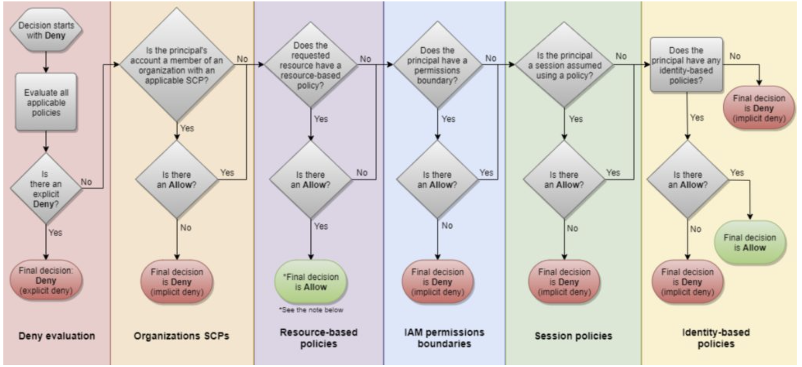

# IAM Policy Evaluation

## Evaluation Logic

## Steps for Authorizing Requests to AWS

1. Authentication - AWS authenticates the principal that makes the request
2. Processing the request context
3. Evaluating all policies within the account
4. Determining whether a request is allowed or denied

- Request context:

  - Actions - the actions or operations the principal wants to perform
  - Resources - the AWS resource object upon which actions are performed
  - Principal - the user, role, federated user, or application that sent the request
  - Environment Data - information about the IP address, user agent, SSL status, or time of day
  - Resource data - data related to the resource that is being requested

  ## Types of Policy

  - Identity-based policies - attached to users, groups, or roles
  - Resource-based policies - attached to a resource; define permissions for a principal accessing the resource
  - IAM permissions boundaries - set the maximum permissions an identity-based policy can grant an IAM entity
  - AWS Organizations service control policies (SCP) - specify the maximum permissions for an organization or OU
  - Session policies - used with AssumeRole\* API actions

  ## Evaluating Policies within an AWS account

  - effective permissions are those granted in either identity-based policy or resource-based policy
  - effective permissions are those granted in both identity-based policy and permissions boundary
  - effective permissions are those granted in both identity-based policy and organizations SCP

  ## Determination Rules

  1. By default, all requests are implicitly denied (though the root user has full access)
  2. An explicit allow in an identity-based or resource-based policy overrides this default
  3. If a permissions boundary, Organizations SCP, or session policy is present, it might override the allow with an implicit deny
  4. An explicit deny in any policy overrides any allow
